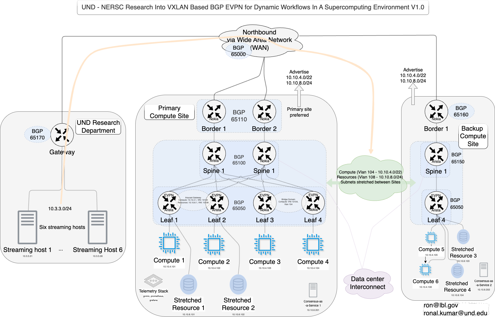
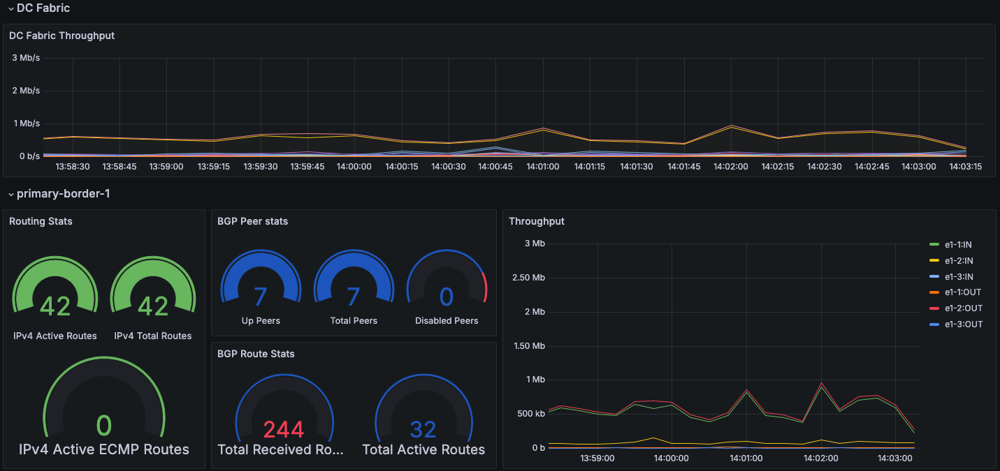

# UND-NERSC-Collaboration

## Overview

Research and development of key enabling technologies in the construction of software-defined data center network architecture using VXLAN based BGP EVPN for dynamic workflows in a supercomputing environment.

This repository deploys multi-vendor lab by using containerlab to spin up a two-tier clos topology using Nokia SR Linux and Arista cEOS. BGP is configured in the underlay and for border connections. eBGP is used to emulate the wide area network cloud. Underlay and overlay network uses BGP. This is work in progress.

## Features

*   Automated Deployment: Automates the setup of complex, multi-vendor network topologies using Containerlab.
*   Multi-Vendor Support: Integrates Linux, Nokia SR Linux, and Arista cEOS network operating systems.
*   VXLAN/BGP EVPN: Implements a modern network virtualization architecture using VXLAN for overlay and BGP EVPN for control plane.
*   Stretched CLOS Topology: Creates a scalable and resilient network fabric based on the CLOS architecture.
*   Programmability: Exposes a programmable environment for network configuration and testing.
*   Demonstrates a VXLAN based BGP EVPN design for workflows spanning across multiple domains.

## Getting Started

### Prerequisites

*   Ubuntu version 20.04.6 LTS or higher.
*   Containerlab version 0.64.0 or higher.
*   Docker Engine installed and running (version 27.2.0 or higher). Automatically installed by step 1.
*   Nokia SR Linux network operating system version 24.10.1. Automatically imported by step 2.
*   Linux network multi-tool version 0.2.0 or higher. Automatically imported by step 2.
*   Arista cEOS version 4.32.4M. Requires guest user registration, license agreement acceptance and cEOS download from https://www.arista.com/en/support/software-download (cEOS Lab > 4.32 > EOS-4.32.4M > cEOS-lab-4.32.4M.tar.xz).

### Installation

Containerlab easily helps deploy the topology by defining all interlinks and node specific information in one YAML file. This file can be used to deploy our topology by passing it as an argument with the deploy command.

1.  Install Containerlab:
      *   Sudo privileges needed to run containerlab.
      *   Quick setup installs docker, Containerlab and gh (CLI tool) in one go.
      *   Script has been tested on Ubuntu 20.04

    ```
    sudo curl -sL https://containerlab.dev/setup | sudo -E bash -s "all"
    ```

### Usage

1.  Clone the repository:

    ```
    git clone https://github.com/ron-nersc/UND-NERSC-Collaboration.git
    cd containerlab-UND-NERSC-Collaboration
    ```

2.  Docker import Arista cEOS-lab-4.32.4M.tar.xz EOS downloaded from prerequisites:

    ```
    sudo docker import cEOS-lab-4.32.4M.tar.xz ceos:4.32.4M
    ```

3.  Deploy the topology:

    ```
    sudo containerlab deploy -t UND-NERSC-Research-1.clab.yml
    ```

4.  Destroy the topology and remove the Lab directory:

    ```
    sudo containerlab destroy -t UND-NERSC-Research-1.clab.yml --cleanup
    ```

### VXLAN based BGP EVPN Multi-site Topology Interaction



*   The topology has a Primary Compute Site, Backup Compute Site and UND site. Primary and Backup Compute sites model a scalable scientific computing facility while UND site models a remote data streaming site, such as University of North Dakota research department.
*   Data center Interconnect models layer 2 evpn service and connects the Primary and Backup Compute sites.
*   The Wide Area Network (WAN) connects all the sites via eBGP AS 65000 and advertises prefixes between the sites.
*   Primary Compute site advertises Compute subnet 10.10.4.0/22 and Stretched Resource subnet 10.10.8.0/24 to the WAN. These subnets are stretched between the Primary Compute site and Backup Compute site, and are always preferred via the Primary site. Primary Compute site border routers are in BGP AS 65110, spines in BGP AS 65100 and leaves in iBGP AS 65050. Primary Compute site has 4 Compute nodes, 2 Stretched Resource nodes, a telemetry stack with gnmic, prometheus, grafana, and a consensus-as-a-service node.
*   Backup Compute site advertises Compute subnet 10.10.4.0/22 and Stretched Resource subnet 10.10.8.0/24 to the WAN. These subnets are always preferred via the Primary Compute site, however, if the Primary Compute site is unavailable then traffic flows to the Backup Compute site. Backup site border routers are in BGP AS 65160, spines in BGP AS 65150 and leaves in iBGP AS 65050. Backup COMpute site has 2 Compute nodes, 2 Stretched Resource nodes, and a consensus-as-a-service node.
*   UND Research site has 6 streaming hosts and the gateway is in BGP AS 65170. 
*   Primary Compute site containers: 
       *   primary-evpn-leaf-1, primary-evpn-leaf-2 and primary-evpn-spine-1 are running cEOS.
       *   primary-evpn-leaf-3, primary-evpn-leaf-4, primary-evpn-spine-2, primary-border-1 and primary-border-2 are runing SR Linux.
       *   primary-compute-1 to 4, primary-stretchedresource-1 to 2, telemetry stack and primary-consensus-as-a-service-1 are running Linux.
*   Backup Compute site containers: 
       *   backup-evpn-leaf-1 and backup-evpn-spine-1 are running cEOS.
       *   backup-border-1 is runing SR Linux.
       *   backup-compute-5 to 6, backup-stretchedresource-3 to 4 and backup-consensus-as-a-service-2 are running Linux.       
*   Data center Interconnect container: 
       *   datacenter-interconnect is running cEOS and provides layer 2 connectivity to the spines in Primary and Backup sites.
*   UND Research site containers: 
       *   und-streaming-host-1 to 6 are running Linux.
       *   und-gateway is running cEOS.       
*   Wide Area Network container: 
       *   wan-cloud is running cEOS.

1.  Interacting with Arista cEOS containers.

    > Connect to `cEOS` nodes, e.g `primary-evpn-leaf-1` node via SSH: `sudo docker exec -it primary-evpn-leaf-1 Cli` Username `admin` Password `admin`
    >
    > Verify underlay BGP peering: `"show bgp summary"` and underlay bgp routes: `"show ip bgp"`
    >
    > Verify overlay BGP peering: `"show bgp evpn summary"` and overlay bgp routes: `"show bgp evpn"`
    >
    > Verify routing to WAN cloud loopback IP: `"traceroute 10.0.254.1"`

2.  Interacting with Nokia SR Linux containers.

    > Connect to 'SR Linux' nodes, e.g `primary-evpn-leaf-3` node via SSH: `sudo docker exec -it primary-evpn-leaf-3 sr_cli` Username `admin` Password `NokiaSrl1!`
    >
    > Verify underlay and overlay BGP peering: `"show network-instance default protocols bgp neighbor"`
    >
    > Verify underlay and overlay bgp routes: `"show network-instance default protocols bgp routes ipv4 summary"` and route table: `"show network-instance route-table all"`
    >
    > Verify routing to WAN cloud loopback IP: `"traceroute network-instance default 10.0.254.1"`

3.  Interacting with Compute containers.

    > Connect to 'Compute' nodes, e.g `primary-compute-1` node via SSH: `sudo docker exec -it primary-compute-1 bash` Username `user@<name>` Password `multit00l.`
    >
    > Verify interfaces: `"ip a"` and routing table: `"route"`
    >
    > Verify reachability over evpn to primary-compute-3: `"ping -c 4 10.10.4.103"` and reachability over data center interconnect evpn to backup-compute-5: `"ping -c 4 10.10.4.105"`
    >
    > Verify reachability over evpn to primary-stretchedresource-1: `"ping -c 4 10.10.8.101"` and reachability over data center interconnect evpn to backup-stretchedresource-3: `"ping -c 4 10.10.8.103"`

3.  Interacting with Compute, Stretched resource, Consensus-as-a-service and Streaming host Linux containers.

    > Connect to 'Linux' nodes, e.g `primary-compute-1` node via SSH: `sudo docker exec -it primary-compute-1 bash` Username `user@<name>` Password `multit00l.`
    >
    > Verify interfaces: `"ip a"` and routing table: `"route"`
    >
    > Verify reachability over evpn to primary-compute-3: `"ping -c 4 10.10.4.103"` and reachability over data center interconnect evpn to backup-compute-5: `"ping -c 4 10.10.4.105"`
    >
    > Verify reachability over evpn to primary-stretchedresource-1: `"ping -c 4 10.10.8.101"` and reachability over data center interconnect to backup-stretchedresource-3: `"ping -c 4 10.10.8.103"`
    >
    > Verify traceroute to backup-stretchedresource-3 over data center interconnect: `"traceroute 10.10.8.103"`
    >
    > Verify reachability over wan to und-streaming-host-1: `"ping -c 4 10.3.3.21"` and traceroute to und-streaming-host-1: `"traceroute 10.3.3.21"`

### Topology IP Schema

Management Subnet for the overall topology: `10.6.1.0/24`

#### Primary Compute Site - Underlay

Loopback `10.0.1.0/24`, Point-to-point `10.6.2.0/24`

| Host                    | Router-id / Loopback0 |
| ----------------------- | --------------------- |
|                         |                       |
| primary-border-1        | 10.0.1.1              |
| primary-border-2        | 10.0.1.2              |
| primary-evpn-spine-1    | 10.0.1.3              |
| primary-evpn-spine-2    | 10.0.1.4              |
| primary-evpn-leaf-1     | 10.0.1.5              |
| primary-evpn-leaf-2     | 10.0.1.6              |
| primary-evpn-leaf-3     | 10.0.1.7              |
| primary-evpn-leaf-4     | 10.0.1.8              |
| datacenter-interconnect | 10.0.1.250            |
| wan-cloud               | 10.0.254.1            |

| Host                 | Side A                       | Side B                                | P2P Subnet /30 - A, B | BGP AS        |
| -------------------- | ---------------------------- | ------------------------------------- | --------------------- | ------------- |
| primary-border-1     | primary-border-1:e1-1        | wan-cloud:eth1                        | 10.6.2.1 - 10.6.2.2   | 65110 - 65000 |
|                      | primary-border-1:e1-2        | primary-evpn-spine-1:eth1             | 10.6.2.5 - 10.6.2.6   | 65110 - 65100 |
|                      | primary-border-1:e1-3        | primary-evpn-spine-2:e1-1             | 10.6.2.9 - 10.6.2.10  | 65110 - 65100 |
| primary-border-2     | primary-border-2:e1-1        | wan-cloud:eth2                        | 10.6.2.13 - 10.6.2.14 | 65110 - 65000 |
|                      | primary-border-2:e1-2        | primary-evpn-spine-1:eth2             | 10.6.2.17 - 10.6.2.18 | 65110 - 65100 |
|                      | primary-border-2:e1-3        | primary-evpn-spine-2:e1-2             | 10.6.2.21 - 10.6.2.22 | 65110 - 65100 |
| primary-evpn-spine-1 | primary-evpn-spine-1:eth3    | primary-evpn-leaf-1:eth1              | 10.6.2.25 - 10.6.2.26 | 65100 - 65050 |
|                      | primary-evpn-spine-1:eth4    | primary-evpn-leaf-2:eth1              | 10.6.2.29 - 10.6.2.30 | 65100 - 65050 |
|                      | primary-evpn-spine-1:eth5    | primary-evpn-leaf-3:e1-1              | 10.6.2.33 - 10.6.2.34 | 65100 - 65050 |
|                      | primary-evpn-spine-1:eth6    | primary-evpn-leaf-4:e1-1              | 10.6.2.37 - 10.6.2.38 | 65100 - 65050 |
|                      | primary-evpn-spine-1:eth10   | datacenter-interconnect:eth1          | 172.16.10.1/24        | layer 2       |
| primary-evpn-spine-2 | primary-evpn-spine-2:e1-3    | primary-evpn-leaf-1:eth2              | 10.6.2.41 - 10.6.2.42 | 65100 - 65050 |
|                      | primary-evpn-spine-2:e1-4    | primary-evpn-leaf-2:eth2              | 10.6.2.45 - 10.6.2.46 | 65100 - 65050 |
|                      | primary-evpn-spine-2:e1-5    | primary-evpn-leaf-3:e1-2              | 10.6.2.49 - 10.6.2.50 | 65100 - 65050 |
|                      | primary-evpn-spine-2:e1-6    | primary-evpn-leaf-4:e1-2              | 10.6.2.53 - 10.6.2.54 | 65100 - 65050 |
|                      | primary-evpn-spine-2:eth1-10 | datacenter-interconnect:eth2          | 172.16.10.2/24        | layer 2       |
| primary-evpn-leaf-1  | primary-evpn-leaf-1:eth3     | primary-compute-1:eth1                | VXLAN                 |               |
|                      | primary-evpn-leaf-1:eth4     | primary-stretchedresource-1:eth1      | VXLAN                 |               |
|                      | primary-evpn-leaf-1:eth5     | primary-telemetry-1:eth1              | VXLAN                 |               |
|                      | primary-evpn-leaf-1:eth7     | primary-consensus-as-a-service-1:eth1 | VXLAN                 |               |
| primary-evpn-leaf-2  | primary-evpn-leaf-2:eth3     | primary-compute-2:eth1                | VXLAN                 |               |
|                      | primary-evpn-leaf-2:eth4     | primary-stretchedresource-2:eth1      | VXLAN                 |               |
|                      | primary-evpn-leaf-2:eth5     | primary-telemetry-2:eth1              | VXLAN                 |               |
| primary-evpn-leaf-3  | primary-evpn-leaf-3:e1-3     | primary-compute-3:eth1                | VXLAN                 |               |
| primary-evpn-leaf-4  | primary-evpn-leaf-4:e1-3     | primary-compute-4:eth1                | VXLAN                 |               |

#### Primary Compute Site - Overlay

|          | Subnet       | Vlan | Vni           |
| -------- | ------------ | ---- | ------------- |
| Compute  | 10.10.4.0/22 | 104  | 10104         |
| Resource | 10.10.8.0/24 | 108  | 10108         |
|          |              |      | default 10100 |

| Host                 | Overlay Loopback1 / VXLAN VTEP |
| -------------------- | ------------------------------ |
| primary-evpn-leaf-1  | 10.10.0.101                    |
| primary-evpn-leaf-2  | 10.10.0.102                    |
| primary-evpn-leaf-3  | 10.0.1.7                       |
| primary-evpn-leaf-4  | 10.0.1.8                       |

|                     | Side A                   | Side B                                | Vlan | IPv4        |
| ------------------- | ------------------------ | ------------------------------------- | ---- | ----------- |
| primary-evpn-leaf-1 | primary-evpn-leaf-1:eth3 | primary-compute-1:eth1                | 104  | 10.10.4.101 |
|                     | primary-evpn-leaf-1:eth4 | primary-stretchedresource-1:eth1      | 108  | 10.10.8.101 |
|                     | primary-evpn-leaf-1:eth6 | primary-consensus-as-a-service-1:eth1 | 108  | 10.10.8.201 |
|                     |                          |                                       |      |             |
| primary-evpn-leaf-2 | primary-evpn-leaf-2:eth3 | primary-compute-2:eth1                | 104  | 10.10.4.102 |
|                     | primary-evpn-leaf-2:eth4 | primary-stretchedresource-2:eth1      | 108  | 10.10.8.102 |
|                     |                          |                                       |      |             |
|                     |                          |                                       |      |             |
| primary-evpn-leaf-3 | primary-evpn-leaf-3:e1-3 | primary-compute-3:eth1                | 104  | 10.10.4.103 |
|                     |                          |                                       |      |             |
| primary-evpn-leaf-4 | primary-evpn-leaf-4:e1-3 | primary-compute-4:eth1                | 104  | 10.10.4.104 |
|                     |                          |                                       |      |             |
|                     | primary-evpn-leaf-2:eth5 | primary-telemetry-2:eth1              |      |             |
|                     |                          |                                       |      |             |
|                     | primary-evpn-leaf-3:e1-3 | primary-compute-3:eth1                | 104  | 10.10.4.105 |
|                     |                          |                                       |      |             |
|                     | primary-evpn-leaf-4:e1-3 | primary-compute-4:eth1                | 104  | 10.10.4.106 |

#### Backup Compute Site - Underlay

Loopback `10.0.2.0/24`, Point-to-point `10.6.3.0/24`

| Host                | Router-id / Loopback0 |
| ------------------- | --------------------- |
| backup-border-1     | 10.0.2.1              |
| backup-evpn-spine-1 | 10.0.2.2              |
| backup-evpn-leaf-1  | 10.0.2.3              |

| Host                | Side A                    | Side B                               | Subnet /30 - A, B    | BGP AS        |
| ------------------- | ------------------------- | ------------------------------------ | -------------------- | ------------- |
| backup-border-1     | backup-border-1:e1-1      | wan-cloud:eth3                       | 10.6.3.1 - 10.6.3.2  | 65160 - 65000 |
|                     | backup-border-1:e1-2      | backup-evpn-spine-1:eth1             | 10.6.3.5 - 10.6.3.6  | 65160 - 65150 |
| backup-evpn-spine-1 | backup-evpn-spine-1:eth2  | backup-evpn-leaf-1:eth1              | 10.6.3.9 - 10.6.3.10 | 65150 - 65050 |
|                     | backup-evpn-spine-1:eth10 | datacenter-interconnect:eth3         | 172.16.10.3/24       | layer 2       |
| backup-evpn-leaf-1  | backup-evpn-leaf-1:eth2   | backup-compute-5:eth1                | VXLAN                |               |
|                     | backup-evpn-leaf-1:eth3   | backup-compute-6:eth1                | VXLAN                |               |
|                     | backup-evpn-leaf-1:eth4   | backup-stretchedresource-3:eth1      | VXLAN                |               |
|                     | backup-evpn-leaf-1:eth5   | backup-stretchedresource-4:eth1      | VXLAN                |               |
|                     | backup-evpn-leaf-1:eth7   | backup-consensus-as-a-service-1:eth1 | VXLAN                |               |

#### Backup Compute Site - Overlay

| Host                | Overlay Loopback1 / VXLAN VTEP |
| ------------------- | -------------------------------|
| backup-evpn-leaf-1  | 10.10.0.201                    |

| Host               | Side A                  | Side B                               | Vlan | IPv4        |
| ------------------ | ----------------------- | ------------------------------------ | ---- | ----------- |
| backup-evpn-leaf-1 | backup-evpn-leaf-1:eth2 | backup-compute-5:eth1                | 104  | 10.10.4.105 |
|                    | backup-evpn-leaf-1:eth3 | backup-compute-6:eth1                | 104  | 10.10.4.106 |
|                    | backup-evpn-leaf-1:eth4 | backup-stretchedresource-1:eth1      | 108  | 10.10.8.103 |
|                    | backup-evpn-leaf-1:eth5 | backup-stretchedresource-2:eth1      | 108  | 10.10.8.104 |
|                    | backup-evpn-leaf-1:eth6 | backup-consensus-as-a-service-2:eth1 | 108  | 10.10.8.202 |

#### UND Research Department 

| Host                 | IP           | Vlan |
| -------------------- | ------------ | ---- |
| und-streaming-host-1 | 10.3.3.21/24 | 3003 |
| und-streaming-host-2 | 10.3.3.22/24 | 3003 |
| und-streaming-host-3 | 10.3.3.23/24 | 3003 |
| und-streaming-host-4 | 10.3.3.24/24 | 3003 |
| und-streaming-host-5 | 10.3.3.25/24 | 3003 |
| und-streaming-host-6 | 10.3.3.26/24 | 3003 |

| Host        | Router-id | Side A           | Side B                    | Subnet /30 - A, B   |               |
| ----------- | --------- | ---------------- | ------------------------- | ------------------- | ------------- |
| und-gateway | 10.0.3.1  | und-gateway:eth1 | wan-cloud:eth4            | 10.6.4.1 - 10.6.4.2 | 65170 - 65000 |
|             |           | und-gateway:eth2 | und-streaming-host-1:eth1 | Vlan3003            |               |
|             |           | und-gateway:eth3 | und-streaming-host-2:eth1 | Vlan3003            |               |
|             |           | und-gateway:eth4 | und-streaming-host-3:eth1 | Vlan3003            |               |
|             |           | und-gateway:eth5 | und-streaming-host-4:eth1 | Vlan3003            |               |
|             |           | und-gateway:eth6 | und-streaming-host-5:eth1 | Vlan3003            |               |
|             |           | und-gateway:eth7 | und-streaming-host-6:eth1 | Vlan3003            |               |

# Traffic Generation

`iperf3` is available on UND streaming hosts in client mode and Compute nodes in server mode. `traffic.sh` script interacts with the streaming hosts and compute nodes and provides traffic streaming capability. 'Telemetry stack' captures the streaming metrics and is detailed under Telemetry section.

1.  Start traffic streaming from `und-streaming-host-1` to `primary-compute-1`.

    > Start traffic streaming: `bash traffic.sh start compute-1`
    >
    > Stop traffic streaming: `bash traffic.sh stop all`

2.  Start traffic streaming from `und-streaming-host-2` to `primary-compute-2`.

    > Start traffic streaming: `bash traffic.sh start compute-2`
    >
    > Stop traffic streaming: `bash traffic.sh stop all`

3.  Start traffic streaming from `und-streaming-host-3` to `primary-compute-3`.

    > Start traffic streaming: `bash traffic.sh start compute-3`
    >
    > Stop traffic streaming: `bash traffic.sh stop all`

4.  Start traffic streaming from `und-streaming-host-4` to `primary-compute-4`.

    > Start traffic streaming: `bash traffic.sh start compute-4`
    >
    > Stop traffic streaming: `bash traffic.sh stop all`

5.  Start traffic streaming from `und-streaming-host-5` to `primary-compute-5`.

    > Start traffic streaming: `bash traffic.sh start compute-5`
    >
    > Stop traffic streaming: `bash traffic.sh stop all`

6.  Start traffic streaming from `und-streaming-host-6` to `primary-compute-6`.

    > Start traffic streaming: `bash traffic.sh start compute-6`
    >
    > Stop traffic streaming: `bash traffic.sh stop all`

7.  Start traffic streaming to all 6 compute nodes.

    > Start traffic streaming: `bash traffic.sh start all`
    >
    > Stop traffic streaming: `bash traffic.sh stop all`

# Telemetry Stack

The following telemetry stack is used in this lab:

 Role                | Software                               | Access via 
---------------------|----------------------------------------|--------------------------------------------------------------|
Telemetry collector  | [gnmic](https://gnmic.openconfig.net/) |                                                              |
Time-Series DB       | [prometheus](https://prometheus.io/)   | http://localhost:9090/graph                                  |
Visualization        | [grafana](https://grafana.com/)        | http://localhost:3000 `admins/grafana@dmin` credentials      |

## gnmic

[gnmic](https://gnmic.openconfig.net/) is an Openconfig project that allows to subscribe to streaming telemetry data from network devices and export it to a variety of destinations. In this lab, gnmic is used to subscribe to the telemetry data from the fabric nodes and export it to the prometheus time-series database.

The gnmic configuration file - [gnmic-config.yml](https://github.com/ron-nersc/UND-NERSC-Collaboration/blob/main/configs/gnmic/gnmic-config.yml) - is applied to the gnmic container at the startup and instructs it to subscribe to the telemetry data and export it to the prometheus time-series database.

## Prometheus

[Prometheus](https://prometheus.io/) is a popular open-source time-series database. It is used in this lab to store the telemetry data exported by gnmic. The prometheus configuration file - [configs/prometheus/prometheus.yml](https://github.com/ron-nersc/UND-NERSC-Collaboration/blob/main/configs/prometheus/prometheus.yml) - has a minimal configuration and instructs prometheus to scrape the data from the gnmic collector with a 5s interval.

## Grafana

Grafana is another key component of this lab as it provides the visualization for the collected telemetry data. Lab's topology file includes grafana node and configuration parameters such as dashboards, datasources and required plugins. Grafana dashboard provided by this repository provides multiple views on the collected real-time data.



# Logging Stack

Included is a modern logging stack comprised of [promtail](https://grafana.com/docs/loki/latest/clients/promtail/) and [loki](https://grafana.com/oss/loki/). The logging stack leverages the promtail->Loki pipeline, where promtail is a log agent that extracts, transforms and ships logs to Loki, a log aggregation system.

The logging infrastructure logs every message that is above Info level. This includes all the BGP messages, all the system messages, all the interface state changes, etc. The dashboard provides a view on the collected logs and allows filtering on a per-application level.

# Lab Lifecycle

Containerlab easily helps deploy the topology by defining all interlinks and node specific information in one YAML file. This file can be used to deploy the topology by passing it as an argument with the deploy command.

    ```
    sudo containerlab deploy -t UND-NERSC-Research-1.clab.yml
    ```

Same goes for destroying the lab.

    ```
    sudo containerlab destroy -t UND-NERSC-Research-1.clab.yml --cleanup
    ```